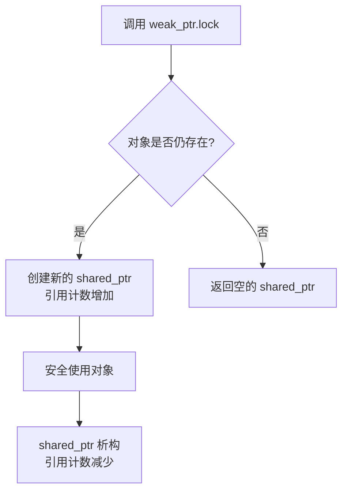

# `std::weak_ptr::lock()` 方法详解

`std::weak_ptr::lock()` 是解决共享所有权中对象生命周期管理问题的关键方法，它提供了安全访问 `weak_ptr` 观察对象的能力。

## 核心作用

`lock()` 方法的主要作用是：**安全地将 `weak_ptr` 提升为 `shared_ptr`，从而获得对被管理对象的临时所有权**。

### 具体功能：
1. **检查对象是否存活**：检查被观察对象是否已被销毁
2. **安全获取访问权限**：如果对象存在，返回有效的 `shared_ptr`（增加引用计数）
3. **避免悬垂指针**：如果对象已被销毁，返回空的 `shared_ptr`
4. **提供临时所有权**：在获取的 `shared_ptr` 生命周期内保证对象不被销毁

## 工作流程



## 关键特性

### 1. 线程安全的对象访问
在多线程环境中安全访问共享资源：
```cpp
void thread_work(std::weak_ptr<Resource> weak_res) {
    if (auto res = weak_res.lock()) {  // 原子操作
        // 安全使用 res
        res->process();
    } else {
        // 对象已被销毁
    }
}
```

### 2. 避免竞态条件
`lock()` 是原子操作，防止在检查和访问之间对象被销毁：
```cpp
// 错误方式：存在竞态条件
if (!weak.expired()) {          // 检查时对象存在
    // 但此时其他线程可能释放了对象
    auto shared = weak.lock();  // 可能得到空指针
    if (shared) {
        shared->use();          // 可能访问无效内存
    }
}

// 正确方式：单步原子操作
if (auto shared = weak.lock()) {
    shared->use();  // 安全访问
}
```

### 3. 临时延长对象生命周期
```cpp
class Observer {
    std::weak_ptr<Subject> subject;
    
    void notify() {
        if (auto s = subject.lock()) {  // 临时获得所有权
            s->update();  // 确保update执行期间对象存活
        }
        // s 析构，引用计数减少
    }
};
```

## 典型使用场景

### 1. 观察者模式
```cpp
class Subject : public std::enable_shared_from_this<Subject> {
    std::vector<std::weak_ptr<Observer>> observers;
    
public:
    void register_observer(std::weak_ptr<Observer> obs) {
        observers.push_back(obs);
    }
    
    void notify_all() {
        for (auto& weak_obs : observers) {
            if (auto obs = weak_obs.lock()) {
                obs->update(shared_from_this());
            }
        }
    }
};
```

### 2. 缓存系统
```cpp
class Cache {
    std::unordered_map<int, std::weak_ptr<Resource>> cache;
    
public:
    std::shared_ptr<Resource> get_resource(int id) {
        if (auto it = cache.find(id); it != cache.end()) {
            if (auto res = it->second.lock()) {
                return res;  // 缓存命中
            }
            cache.erase(it);  // 清理过期条目
        }
        // 创建新资源
        auto res = std::make_shared<Resource>(id);
        cache[id] = res;
        return res;
    }
};
```

### 3. 解决循环引用
```cpp
class Parent {
    std::shared_ptr<Child> child;
};

class Child {
    std::weak_ptr<Parent> parent;  // 使用 weak_ptr 打破循环
    
public:
    void do_something() {
        if (auto p = parent.lock()) {
            p->help();  // 安全访问父对象
        }
    }
};
```

## 与相关方法的比较

| 方法 | 功能 | 是否增加引用计数 | 是否线程安全 |
|------|------|------------------|--------------|
| `lock()` | 安全获取 `shared_ptr` | 是（成功时） | 是 |
| `expired()` | 检查对象是否销毁 | 否 | 是 |
| `use_count()` | 获取引用计数 | 否 | 是（但结果可能立即过时） |

**最佳实践**：总是优先使用 `lock()` 而不是 `expired()` + `lock()` 组合，因为前者是原子操作，避免竞态条件。

## 重要注意事项

1. **返回值是临时 `shared_ptr`**：
   ```cpp
   void process(std::weak_ptr<Data> weak) {
       auto temp = weak.lock();  // 延长生命周期
       if (temp) {
           // 安全使用 temp
       }
       // temp 析构，引用计数减少
   }
   ```

2. **不要存储 `lock()` 的结果长期使用**：
   ```cpp
   // 错误：可能长期持有不必要的引用
   class BadDesign {
       std::shared_ptr<Resource> resource;  // 应使用 weak_ptr
   public:
       BadDesign(std::weak_ptr<Resource> weak) 
           : resource(weak.lock()) {}  // 长期持有
   };
   ```

3. **性能考量**：
    - `lock()` 是原子操作，有轻微性能开销
    - 在性能关键路径中避免频繁调用
    - 考虑缓存结果（但需注意生命周期管理）

## 总结

`std::weak_ptr::lock()` 是 C++ 智能指针体系中至关重要的安全机制：

1. **安全网关**：提供访问 `weak_ptr` 观察对象的唯一安全通道
2. **生命周期管理**：临时延长对象生命周期，避免访问已销毁对象
3. **线程安全**：原子操作消除竞态条件
4. **资源优化**：不增加长期引用计数，避免不必要的资源保留

正确使用 `lock()` 可以构建既安全又高效的资源管理模型，特别是在观察者模式、缓存系统和解决循环引用等场景中。