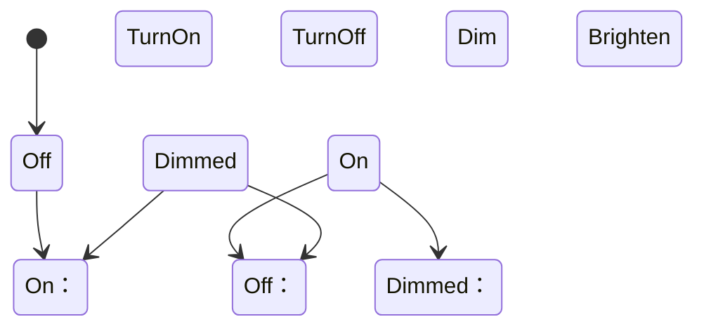

### 状态机（State Machine）详解

#### 基本概念
状态机是一种数学模型，用于描述对象在**有限状态**之间的转换行为。它包含三个核心要素：
1. **状态（State）**：系统可能处于的有限种状况
2. **事件（Event）**：触发状态转换的条件或动作
3. **转移（Transition）**：事件发生时状态变化的规则



#### C++ 实现示例（两种方法）

##### 方法1：枚举 + Switch（简单场景）
```cpp
#include <iostream>

// 状态定义
enum class LightState { OFF, ON, DIMMED };

// 事件定义
enum class Event { TURN_ON, TURN_OFF, DIM, BRIGHTEN };

int main() {
    LightState state = LightState::OFF;
    const Event events[] = { Event::TURN_ON, Event::DIM, Event::BRIGHTEN, Event::TURN_OFF };

    for (Event e : events) {
        switch (state) {
            case LightState::OFF:
                if (e == Event::TURN_ON) {
                    std::cout << "Turning light ON\n";
                    state = LightState::ON;
                }
                break;
                
            case LightState::ON:
                if (e == Event::TURN_OFF) {
                    std::cout << "Turning light OFF\n";
                    state = LightState::OFF;
                } else if (e == Event::DIM) {
                    std::cout << "Dimming light\n";
                    state = LightState::DIMMED;
                }
                break;
                
            case LightState::DIMMED:
                if (e == Event::BRIGHTEN) {
                    std::cout << "Brightening light\n";
                    state = LightState::ON;
                } else if (e == Event::TURN_OFF) {
                    std::cout << "Turning OFF dimmed light\n";
                    state = LightState::OFF;
                }
                break;
        }
    }
}
/* 输出：
Turning light ON
Dimming light
Brightening light
Turning light OFF */
```

##### 方法2：状态模式（复杂场景 - 面向对象）
```cpp
#include <iostream>
#include <memory>

// 前向声明
class Context;

// 抽象状态基类
class State {
public:
    virtual void handle(Context* context) = 0;
    virtual ~State() = default;
};

// 具体状态：关闭
class OffState : public State {
public:
    void handle(Context* context) override;
};

// 具体状态：开启
class OnState : public State {
public:
    void handle(Context* context) override;
};

// 具体状态：调光
class DimmedState : public State {
public:
    void handle(Context* context) override;
};

// 状态机上下文
class Context {
    std::unique_ptr<State> state;
public:
    Context() : state(std::make_unique<OffState>()) {}
    
    void setState(std::unique_ptr<State> newState) {
        state = std::move(newState);
    }
    
    void request() {
        state->handle(this);
    }
};

// 状态处理实现
void OffState::handle(Context* context) {
    std::cout << "Turning light ON\n";
    context->setState(std::make_unique<OnState>());
}

void OnState::handle(Context* context) {
    std::cout << "Dimming light\n";
    context->setState(std::make_unique<DimmedState>());
}

void DimmedState::handle(Context* context) {
    std::cout << "Turning OFF dimmed light\n";
    context->setState(std::make_unique<OffState>());
}

int main() {
    Context light;
    light.request(); // OFF -> ON
    light.request(); // ON -> DIMMED
    light.request(); // DIMMED -> OFF
}
/* 输出：
Turning light ON
Dimming light
Turning OFF dimmed light */
```

#### 状态机核心优势
1. **逻辑清晰**：将复杂流程分解为离散状态
2. **可维护性**：状态变更局部化，避免条件语句嵌套
3. **可扩展性**：新增状态只需添加新类/分支，不修改原有逻辑
4. **错误预防**：非法状态转换可显式拦截（如示例中未实现的状态转换）

#### 典型应用场景
- 游戏角色AI
- 网络协议处理（TCP状态机）
- 用户界面工作流
- 硬件设备控制（如电梯控制）
- 词法分析/语法解析

> **设计建议**：对于超过3个状态的系统，推荐使用状态模式（方法2），避免switch-case的维护复杂性。使用`std::unique_ptr`管理状态可确保内存安全，符合现代C++实践。